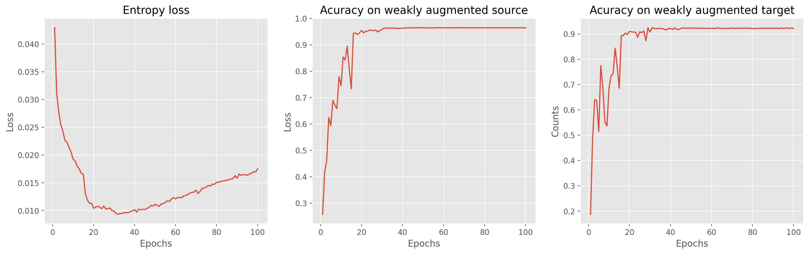
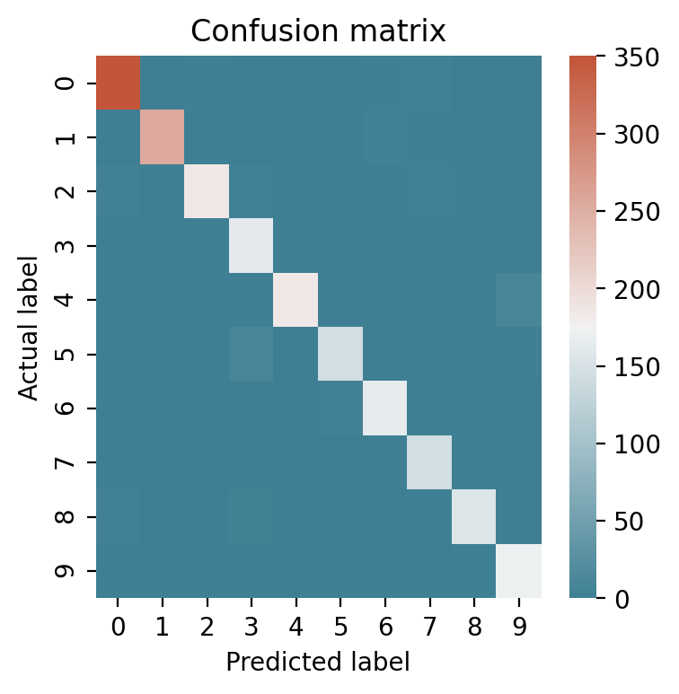

# AdaMatch-pytorch
A PyTorch implementation of [AdaMatch: A Unified Approach to Semi-Supervised Learning and Domain Adaptation](https://arxiv.org/abs/2106.04732).

This implementation is heavily based off of [Sayak Paul](https://github.com/sayakpaul)'s excellent [keras blog post](https://keras.io/examples/vision/adamatch/).

## How to run?
You can run this code simply by doing:
```
python run.py
```

Note that this implementation is to be used more as a starting point, and you'll have to dig a little deeper on the python code in order to change hyperparameters, transforms and the data that is being loaded.

For this implementation I train a ResNet18 from scratch and apply it to a MNIST (source) -> USPS (target) domain shift. This is the accuracy after 100 epochs of training: 
- Accuracy on source dataset = _0.9645_ 
- Accuracy on target dataset = _0.9217_ 

The training metrics (test set accuracy accuracy) and confusion matrix (target test set) are, respectivelly:



## What's the difference from the TensorFlow implementation?
There are some very important differences:
1. I don't use RandAugment for the strong augmentations. The main reason is because I couldn't get available RandAugment PyTorch implementations to work with MNIST & USPS data. To compensate for it I did some DIY transforms that are very hacky, but seem to get the job done. I'd advise trying out stronger augmentations though.
2. I use a ResNet18 as my classifier. It shouldn't be too hard to use other networks though, it's juts a matter of importing another network in its place.
3. The TensorFlow implementation uses `CosineDecay` for the learning rate scheduler. I tried replicating it in PyTorch with `CosineAnnealingWarmRestarts`, but the results weren't that great, so I settled with using a `StepLR` scheduler.

## Comments
I'm new in the area of unsupervised domain adaptation so I might've gotten some things wrong. If you notice anything that looks out of the ordinary feel free to open an issue. Suggestions are very much appreciated! :)
